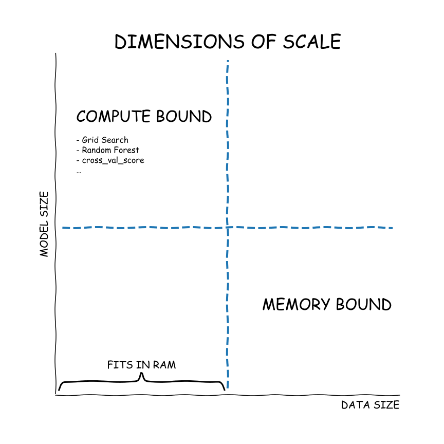

# Dask-ML Tutorial

This tutorial was initally given at the Dask Distributed Summit 2021.

[Dask-ML](https://ml.dask.org) provides scalable machine learning in Python
using Dask alongside popular machine learning libraries like Scikit-Learn,
XGBoost, and others.

We generally consider two primary challenges when scaling machine learning code,
scaling model size and data size. `dask-ml` offers ways to address each.

"

## Prepare

### You should clone this repository

    git clone http://github.com/programmylife/dask-ml-tutorial-summit-2021

and then install necessary packages.
There are three different ways to achieve this, pick the one that best suits you, and ***only pick one option***.
They are, in order of preference:

### Create a conda environment

In the main repo directory

    conda env create -f binder/environment.yml
    conda activate dask-ml-tutorial
    jupyter labextension install dask-labextension
    jupyter labextension install @jupyter-widgets/jupyterlab-manager
    jupyter labextension install @bokeh/jupyter_bokeh
